# 胸影智诊V2.0 - 企业级医疗AI胸部X光智能辅助诊断系统

<p align="center">
  <b>基于深度学习 MobileNetV2 的胸部X光智能辅助诊断系统</b><br>
  覆盖正常、肺炎、肺结核三类诊断场景，提供AI诊断、Grad-CAM热力图、患者管理、诊断报告生成等企业级功能。<br>
  <a href="https://github.com/YLJ109/AIXRayDetectionV2.0-Agent-">GitHub 仓库</a>
</p>

<p align="center">
  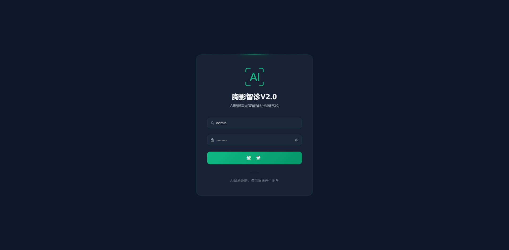
  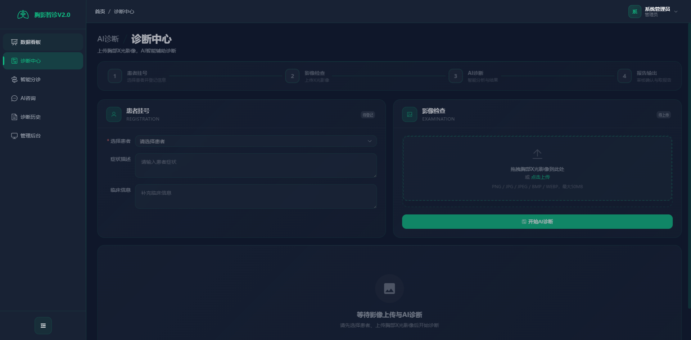
  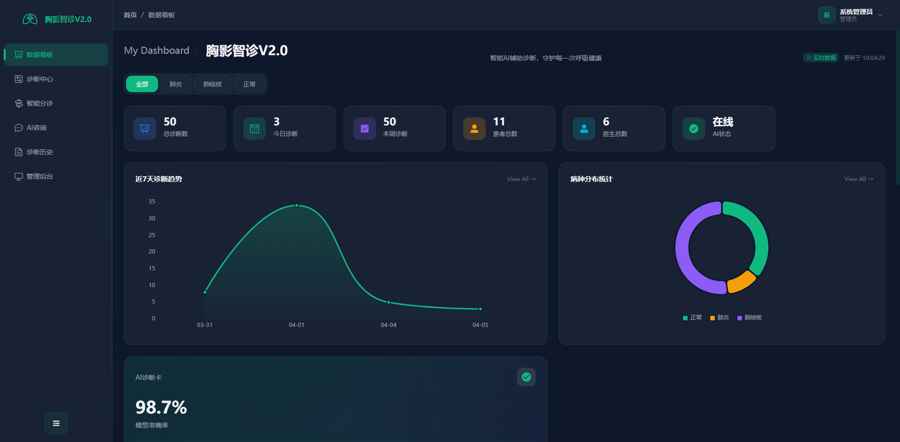
  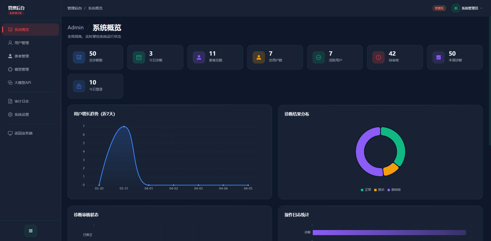
</p>

---

## 目录

- [项目简介](#项目简介)
- [功能特性](#功能特性)
  - [业务端功能](#业务端功能)
  - [管理端功能](#管理端功能)
- [系统演示](#系统演示)
- [技术架构](#技术架构)
  - [架构总览](#架构总览)
  - [技术栈](#技术栈)
  - [项目结构](#项目结构)
- [快速开始](#快速开始)
  - [环境要求](#环境要求)
  - [后端部署](#后端部署)
  - [前端部署](#前端部署)
  - [默认账号](#默认账号)
- [生产部署](#生产部署)
  - [Docker Compose 部署（推荐）](#docker-compose-部署推荐)
  - [手动部署](#手动部署)
- [API 文档](#api-文档)
  - [认证方式](#认证方式)
  - [接口总览](#接口总览)
  - [响应格式](#响应格式)
- [AI 模型说明](#ai-模型说明)
- [安全合规](#安全合规)
- [常见问题](#常见问题)
- [贡献指南](#贡献指南)
- [许可证](#许可证)

---

## 项目简介

**胸影智诊V2.0** 是一套面向医疗影像领域的智能辅助诊断系统，基于深度学习技术对胸部X光影像进行自动化分析。系统采用 Flask + Vue3 前后端分离架构，AI 推理引擎基于 PyTorch 与 MobileNetV2 卷积神经网络模型，集成大语言模型（LLM）实现诊断报告自动生成。

系统能够对胸部X光影像进行三类智能诊断分类：**正常（Normal）**、**肺炎（Pneumonia）**、**肺结核（Tuberculosis）**，并输出各类别的概率分布、诊断置信度以及 Grad-CAM 热力图可视化结果。

> **声明**：AI诊断结论仅供临床医生参考，不作为最终诊断依据。

---

## 功能特性

### 业务端功能

| 功能模块 | 说明 |
|---------|------|
| **AI诊断中心** | 影像上传、MobileNetV2 三分类推理、Grad-CAM 热力图可视化 |
| **智能报告** | 大语言模型自动生成专业诊断报告，医生审核机制 |
| **智能分诊** | 基于AI模型的快速分诊评估，支持批量影像分析 |
| **AI医学咨询** | 聊天式AI医学知识问答，多轮对话，会话持久化 |
| **患者管理** | 档案 CRUD、病史记录、过敏史、诊断历史关联 |
| **数据看板** | 诊断量统计、病种分布饼图、趋势图表、模型性能监控 |
| **诊断历史** | 按时间线展示所有诊断记录，支持搜索筛选与报告下载 |

### 管理端功能

| 功能模块 | 说明 |
|---------|------|
| **系统概览** | 全局数据概览、系统运行状态实时监控 |
| **用户管理** | 管理员/医生/护士三级角色管理，账号生命周期管控 |
| **患者管理** | 患者档案全局管理，多维搜索与数据导出 |
| **模型管理** | AI模型加载状态监控、推理性能指标、参数在线调整 |
| **大模型API** | 多LLM提供商统一管理（通义千问/OpenAI/DeepSeek/豆包），优先级调度 |
| **审计日志** | 全操作日志记录，按用户/操作类型/时间筛选，IP追踪 |
| **API文档** | 内置接口文档，方便前端对接与第三方集成 |
| **系统设置** | 全局参数配置、安全策略与访问控制 |

---

## 系统演示

### 用户登录

系统提供安全的JWT认证登录，支持管理员、医生、护士三种角色。


### AI智能诊断中心

核心功能模块，支持影像上传、AI推理、热力图生成和报告自动生成。


### 智能分诊

基于AI模型的快速分诊评估，辅助医护人员快速分流患者。

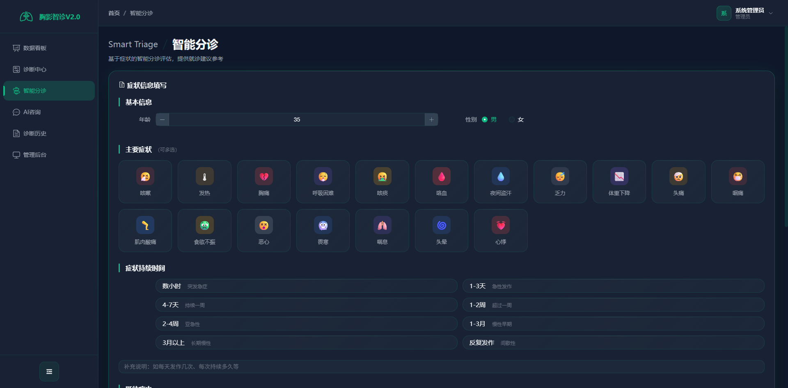

### 数据看板

多维度数据可视化分析，包含诊断量统计、病种分布、趋势图表等。


### AI医学咨询

集成大语言模型的聊天式医学知识问答，支持多轮对话与会话持久化。

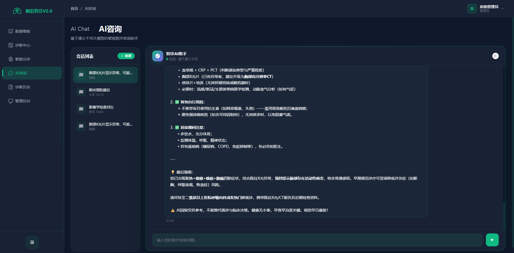

### 诊断历史

按时间线展示诊断记录，支持搜索筛选与报告下载。

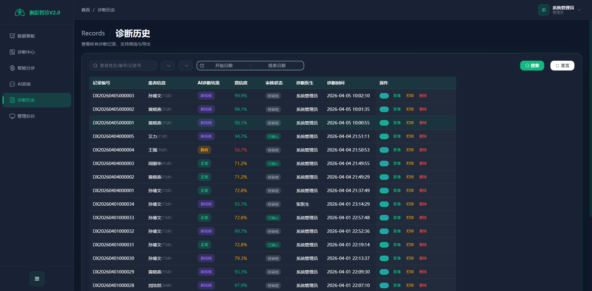

### 后台管理 - 系统概览

管理员全局视角，监控核心指标与系统运行状态。


### 后台管理 - 用户管理

多角色用户权限管理，支持账号创建、编辑、禁用等操作。

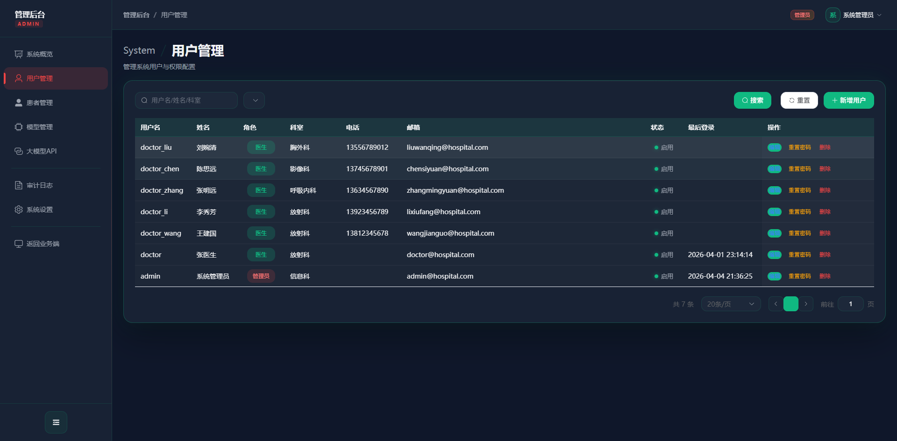

### 后台管理 - 患者管理

患者档案全生命周期管理，支持病史记录与诊断历史关联。

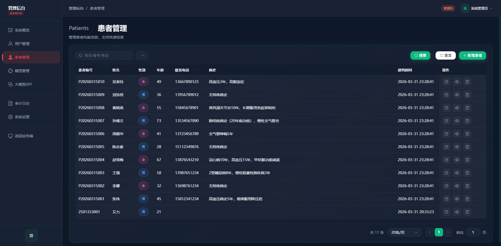

### 后台管理 - 模型管理

AI模型监控与配置，实时展示推理性能指标。

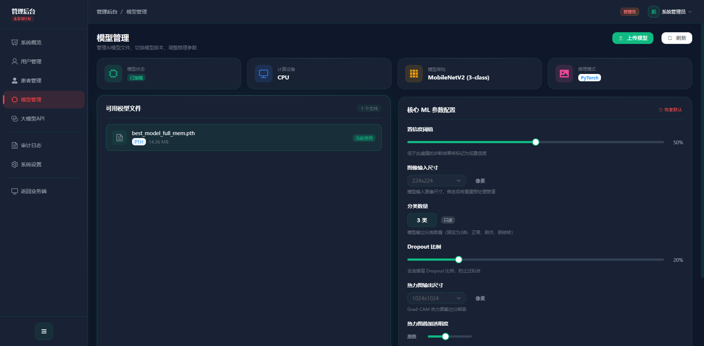

### 后台管理 - 大模型API管理

多LLM提供商统一管理，支持API测试与优先级调度。

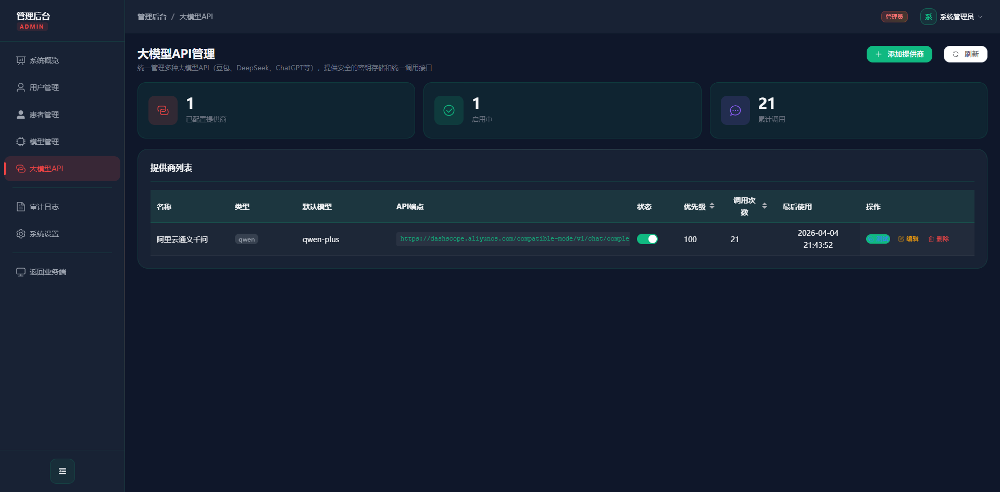

### 后台管理 - 审计日志

全操作审计追溯，满足医疗数据安全合规要求。

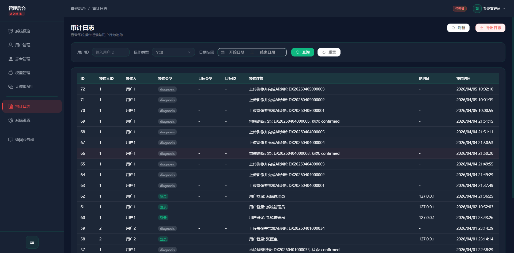

### 后台管理 - 系统设置

全局参数配置，包含API限流阈值、安全策略等。

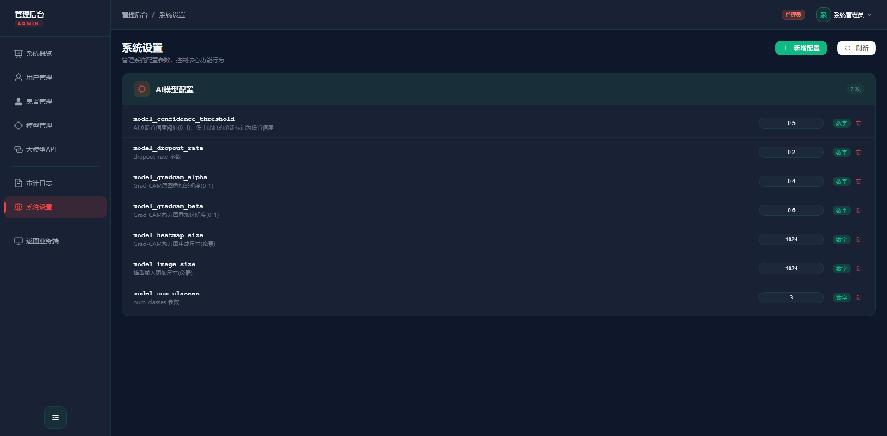

---

## 技术架构

### 架构总览

系统采用经典的 B/S 三层架构，包含表现层（Web前端）、业务逻辑层（Flask后端）和数据持久层（SQLite/MySQL数据库）。

```
┌─────────────────────────────────────────────────┐
│                   表现层                         │
│          Vue3 + Element Plus + Pinia             │
│          ECharts 数据可视化                       │
├─────────────────────────────────────────────────┤
│                 业务逻辑层                        │
│    Flask RESTful API + JWT 认证                  │
│    ┌──────────┬──────────┬──────────┐           │
│    │ AI推理层  │ LLM服务层 │ 业务服务层 │           │
│    │MobileNetV2│通义千问等 │诊断/患者  │           │
│    │Grad-CAM  │OpenAI    │用户/LLM   │           │
│    └──────────┴──────────┴──────────┘           │
├─────────────────────────────────────────────────┤
│                 数据持久层                        │
│       SQLite（开发）/ MySQL（生产）              │
│       SQLAlchemy ORM                             │
└─────────────────────────────────────────────────┘
```

### 技术栈

| 层级 | 技术 | 版本 | 说明 |
|------|------|------|------|
| 后端框架 | Flask | 2.3.3 | 轻量级 Python Web 框架 |
| ORM | SQLAlchemy | 2.0+ | 强大的 Python ORM |
| 认证授权 | Flask-JWT-Extended | 4.5.3 | JWT Token 认证 |
| API限流 | Flask-Limiter | 3.5.0 | 请求频率控制 |
| AI框架 | PyTorch | 2.6.0+ | 深度学习推理引擎 |
| 图像处理 | OpenCV + Pillow | 4.8 / 10.1 | 图像预处理与格式转换 |
| LLM | OpenAI SDK | 1.12+ | 多提供商统一调用 |
| 前端框架 | Vue 3 | 3.3.4 | 渐进式 JavaScript 框架 |
| UI组件 | Element Plus | 2.4.0 | 企业级 Vue3 组件库 |
| 状态管理 | Pinia | 2.1.6 | Vue3 官方状态管理 |
| 图表 | ECharts + vue-echarts | 5.4.3 | 数据可视化 |
| 构建工具 | Vite | 5.4.14 | 快速前端构建 |
| 部署 | Docker + Nginx | - | 容器化 + 反向代理 |

### 项目结构

```
AIXRayDetectionV2.0(Agent)/
│
├── AiXRayFilmDetectionSystem/          # 主应用系统
│   ├── backend/                        # Flask 后端
│   │   ├── api/                        #   API路由模块
│   │   │   ├── auth.py                 #     认证接口（登录/注册/Token刷新）
│   │   │   ├── diagnosis.py            #     诊断接口（AI推理/报告生成）
│   │   │   ├── patient.py              #     患者管理接口
│   │   │   ├── user.py                 #     用户管理接口
│   │   │   ├── llm.py                  #     大模型API管理接口
│   │   │   └── system.py               #     系统管理接口（健康检查/数据看板）
│   │   ├── core/                       #   核心配置
│   │   │   ├── config.py               #     多环境配置（开发/生产/测试）
│   │   │   └── extensions.py           #     Flask扩展初始化
│   │   ├── models/                     #   SQLAlchemy ORM 数据模型
│   │   ├── services/                   #   业务逻辑层
│   │   │   ├── model_service.py        #     AI模型加载与推理
│   │   │   ├── diagnosis_service.py    #     诊断业务逻辑
│   │   │   ├── patient_service.py      #     患者档案管理
│   │   │   ├── user_service.py         #     用户认证与权限
│   │   │   └── llm_service.py          #     大语言模型调用
│   │   ├── utils/                      #   工具类（审计日志/图像预处理）
│   │   ├── weights/                    #   AI模型权重目录
│   │   │   └── best_model_full_mem.pth #     训练好的模型文件
│   │   ├── static/                     #   静态文件（运行时自动创建）
│   │   ├── data/                       #   SQLite数据库
│   │   ├── app.py                      #   Flask应用入口
│   │   ├── init_database.py            #   数据库初始化脚本
│   │   └── requirements.txt            #   Python依赖
│   │
│   ├── frontend/                       # Vue3 前端
│   │   ├── src/
│   │   │   ├── api/                    #   Axios HTTP请求封装
│   │   │   ├── components/             #   公共组件（Layout/AdminLayout）
│   │   │   ├── router/                 #   路由配置（含权限守卫）
│   │   │   ├── stores/                 #   Pinia状态管理
│   │   │   ├── styles/                 #   全局样式（玻璃拟态深色科技风）
│   │   │   └── views/                  #   页面视图
│   │   │       ├── Login.vue           #     登录页
│   │   │       ├── Dashboard.vue       #     数据看板
│   │   │       ├── Diagnosis.vue       #     诊断中心
│   │   │       ├── Triage.vue          #     智能分诊
│   │   │       ├── Consultation.vue    #     AI咨询
│   │   │       ├── History.vue         #     诊断历史
│   │   │       ├── PatientManagement.vue #  患者管理
│   │   │       ├── Users.vue           #     用户管理
│   │   │       └── admin/              #     管理员页面
│   │   ├── package.json
│   │   └── vite.config.js
│   │
│   ├── deploy/                         # 部署配置
│   │   ├── nginx.conf                  #   Nginx反向代理
│   │   ├── supervisord.conf            #   进程管理
│   │   └── entrypoint.sh               #   容器启动脚本
│   ├── Dockerfile                      # Docker多阶段构建
│   ├── docker-compose.yml              # Docker编排
│   └── .env                            # 环境变量
│
├── medical_xray_3060_train/            # 模型训练模块
│   └── scripts/                        #   训练脚本与配置
│
├── 项目图片/                            # 项目截图
└── README.md                           # 本文档
```

---

## 快速开始

### 环境要求

| 组件 | 版本要求 | 说明 |
|------|---------|------|
| Python | 3.9+ | 必需 |
| Node.js | 16+ | 必需 |
| npm | 7+ | 必需 |
| NVIDIA GPU | GTX 1060 / RTX 3060+ | 可选（CPU推理） |
| CUDA | 12.x+ | 可选（GPU加速） |
| Docker | 20.10+ | 可选（容器部署） |

### 后端部署

```bash
# 1. 进入后端目录
cd AiXRayFilmDetectionSystem/backend

# 2. 创建虚拟环境（推荐）
python -m venv venv
venv\Scripts\activate          # Windows
source venv/bin/activate       # Linux/macOS

# 3. 安装 Python 依赖
pip install -r requirements.txt

# 4. 初始化数据库（创建表 + 默认数据）
python init_database.py

# 5. 启动服务
python app.py
# 访问 http://localhost:5000
```

### 前端部署

```bash
# 1. 进入前端目录
cd AiXRayFilmDetectionSystem/frontend

# 2. 安装依赖
npm install

# 3. 启动开发服务器
npm run dev
# 访问 http://localhost:5173

# 4. 生产构建（可选）
npm run build
# 构建产物在 dist/ 目录
```

### 默认账号

| 角色 | 用户名 | 密码 | 科室 |
|------|--------|------|------|
| 管理员 | admin | admin123 | 信息科 |
| 医生 | doctor_wang | doctor123 | 放射科 |
| 医生 | doctor_li | doctor123 | 放射科 |
| 医生 | doctor_zhang | doctor123 | 呼吸内科 |
| 医生 | doctor_chen | doctor123 | 影像科 |
| 医生 | doctor_liu | doctor123 | 胸外科 |

---

## 生产部署

### Docker Compose 部署（推荐）

```bash
# 1. 将模型权重放入 backend/weights/ 目录
cp best_model_full_mem.pth AiXRayFilmDetectionSystem/backend/weights/

# 2. 配置环境变量
cp .env.example .env
# 编辑 .env 文件，设置 SECRET_KEY、JWT_SECRET_KEY、OPENAI_API_KEY 等

# 3. 一键构建并启动
docker compose up -d --build

# 4. 查看运行日志
docker compose logs -f

# 5. 健康检查
curl http://localhost:5000/api/system/health
```

**Docker 数据卷说明：**

| 容器路径 | 用途 |
|---------|------|
| `/app/backend/weights` | AI模型权重文件 |
| `/app/backend/static` | 上传影像、热力图、报告 |
| `/app/backend/data` | SQLite数据库文件 |

### 手动部署

```bash
# ===== 后端 =====
cd AiXRayFilmDetectionSystem/backend
pip install -r requirements.txt
python init_database.py

# 使用 Gunicorn 启动（推荐）
gunicorn -w 4 -b 0.0.0.0:5000 "backend.app:create_app()"

# ===== 前端 =====
cd AiXRayFilmDetectionSystem/frontend
npm install && npm run build

# 使用 Nginx 托管前端并反向代理 API
# 参考 deploy/nginx.conf 配置文件
```

---

## API 文档

### 认证方式

所有业务接口需在请求头携带 JWT Token：

```
Authorization: Bearer <access_token>
```

Token 通过 `/api/auth/login` 接口获取，Access Token 有效期 **8小时**，Refresh Token 有效期 **30天**。

### 接口总览

| 蓝图 | 路由前缀 | 核心接口 | 说明 |
|------|---------|---------|------|
| **auth** | `/api/auth` | `POST /login` | 用户登录 |
| | | `POST /register` | 用户注册 |
| | | `POST /refresh` | Token刷新 |
| | | `GET /me` | 获取当前用户信息 |
| **diagnosis** | `/api/diagnosis` | `POST /upload` | 上传影像并诊断 |
| | | `GET /history` | 诊断历史列表 |
| | | `GET /<id>` | 诊断详情 |
| | | `GET /report/<id>` | 获取诊断报告 |
| **patient** | `/api/patients` | `GET /` | 患者列表 |
| | | `POST /` | 创建患者 |
| | | `PUT /<id>` | 更新患者 |
| | | `GET /<id>/diagnoses` | 患者诊断历史 |
| **user** | `/api/users` | `GET /` | 用户列表 |
| | | `PUT /<id>` | 更新用户 |
| | | `PUT /<id>/role` | 修改角色 |
| | | `PUT /<id>/reset-password` | 重置密码 |
| **system** | `/api/system` | `GET /health` | 健康检查 |
| | | `GET /dashboard` | 看板数据 |
| | | `GET /stats` | 统计数据 |
| **llm** | `/api/llm` | `GET /providers` | 提供商列表 |
| | | `POST /providers` | 创建提供商 |
| | | `POST /providers/<id>/test` | 测试API连通性 |

### 响应格式

所有接口统一返回 JSON 格式：

```json
{
  "code": 200,
  "message": "操作成功",
  "data": { }
}
```

| code | 说明 |
|------|------|
| 200 | 成功 |
| 400 | 参数错误 |
| 401 | 未认证/Token过期 |
| 403 | 权限不足 |
| 404 | 资源不存在 |
| 429 | 请求过于频繁（限流） |
| 500 | 服务器内部错误 |

### API 限流策略

| 接口类型 | 限流阈值 |
|---------|---------|
| 全局默认 | 200 次/分钟 |
| AI诊断 | 30 次/分钟 |
| 用户登录 | 10 次/分钟 |
| 文件上传 | 20 次/分钟 |

---

## AI 模型说明

### 模型架构

系统采用 **MobileNetV2** 作为骨干网络进行迁移学习，在 ImageNet 预训练权重基础上微调，分类头替换为 3 类全连接输出层。

| 属性 | 值 |
|------|-----|
| 模型名称 | MobileNetV2 |
| 输入尺寸 | 224 x 224 x 3 (RGB) |
| 输出类别 | 正常(Normal) / 肺炎(Pneumonia) / 肺结核(Tuberculosis) |
| 参数量 | ~3.4M |
| 推理设备 | 自动检测 GPU/CPU |
| 模型文件 | `weights/best_model_full_mem.pth` |

### 诊断流程

1. **影像上传** → 格式校验（支持 PNG/JPG/BMP/DCM/GIF/WebP）
2. **图像预处理** → 尺寸归一化(224x224) + 像素标准化
3. **AI推理** → MobileNetV2 前向传播 + Softmax 概率输出
4. **热力图生成** → Grad-CAM 可视化 AI 关注区域
5. **报告生成** → LLM 根据诊断结果自动生成结构化报告
6. **医生审核** → 医生确认或修改诊断结论

---

## 安全合规

| 安全措施 | 实现方式 |
|---------|---------|
| **认证授权** | JWT 双 Token 机制 + RBAC 角色控制 |
| **密码安全** | bcrypt 哈希（salt rounds=12） |
| **API限流** | Flask-Limiter 按接口类型限流 |
| **CORS防护** | 白名单域名跨域控制 |
| **文件上传** | 50MB限制 + 扩展名白名单 |
| **审计日志** | 全操作记录（用户/IP/操作/时间） |
| **数据安全** | 软删除机制（is_deleted），数据可恢复 |
| **密钥加密** | LLM API密钥 AES 加密存储 |
| **合规声明** | AI诊断结论标注"仅供临床医生参考" |

---

## 常见问题

### Q: 模型加载失败怎么办？

确保 `best_model_full_mem.pth` 文件存在于 `backend/weights/` 目录下。检查 PyTorch 版本是否 >= 2.6.0。

### Q: 如何切换为 MySQL 数据库？

修改环境变量 `FLASK_ENV=production`，系统会自动使用 ProductionConfig 中的 MySQL 连接配置。需提前安装 `pymysql`。

### Q: 如何配置 LLM 提供商？

通过管理后台的「大模型API」页面添加提供商，填入 API Key 和接口地址即可。支持通义千问、OpenAI、DeepSeek、豆包等兼容 OpenAI SDK 格式的提供商。

### Q: 如何启用 GPU 加速？

安装 CUDA 版本的 PyTorch，系统会自动检测 GPU 并使用。推理速度可提升 5-10 倍。

### Q: Docker 部署后如何查看日志？

```bash
docker compose logs -f           # 查看所有日志
docker compose logs -f backend   # 仅查看后端日志
```

### Q: 如何重置数据库？

删除 `backend/data/aixray_dev.db` 文件后重新执行 `python init_database.py` 即可。

---

## 贡献指南

欢迎贡献代码！请遵循以下流程：

1. **Fork** 本仓库
2. 创建特性分支：`git checkout -b feature/your-feature`
3. 提交更改：`git commit -m 'Add your feature'`
4. 推送分支：`git push origin feature/your-feature`
5. 提交 **Pull Request**

### 代码规范

- **后端**：遵循 PEP 8 规范，使用类型注解
- **前端**：遵循 Vue3 Composition API 风格，使用 ESLint
- **提交信息**：使用 Conventional Commits 格式（如 `feat:`, `fix:`, `docs:`）

### 开发环境配置

```bash
# 后端
cd AiXRayFilmDetectionSystem/backend
python -m venv venv && venv\Scripts\activate
pip install -r requirements.txt

# 前端
cd AiXRayFilmDetectionSystem/frontend
npm install
```

---

## 许可证

本项目仅供学习和研究使用。AI诊断结论仅供临床医生参考，不作为最终诊断依据。

---

<p align="center">
  <b>胸影智诊V2.0</b> · 企业级医疗AI胸部X光智能辅助诊断系统
</p>
